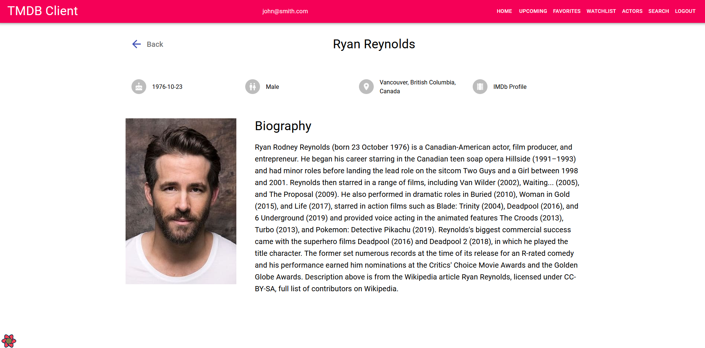
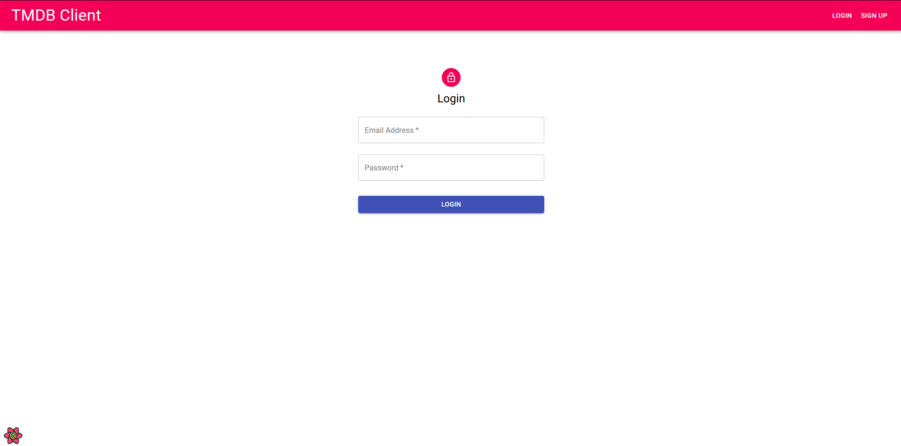
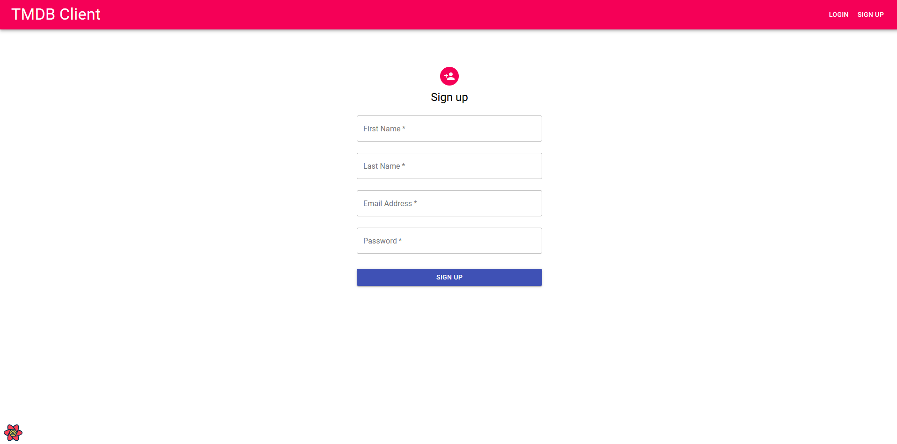
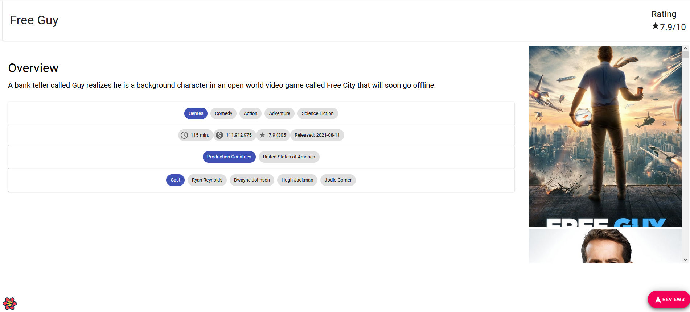
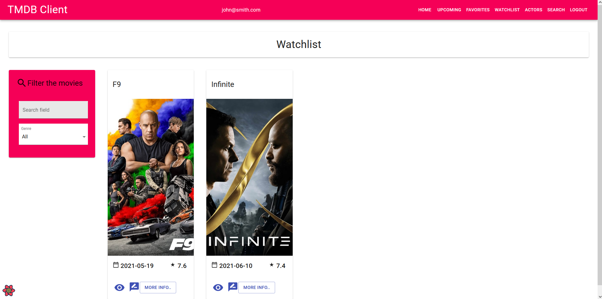
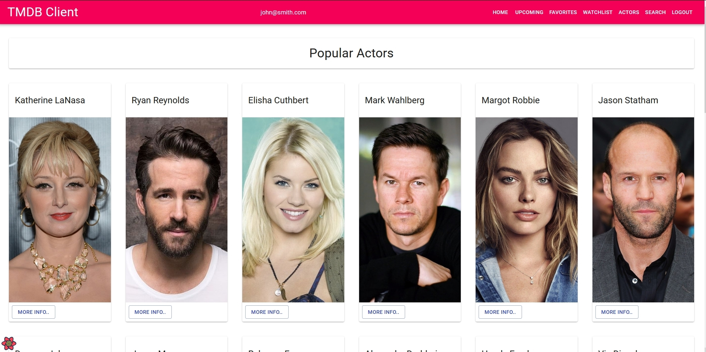

# Assignment - ReactJS app.

Name: Tony Naughton

## Overview.

This app is an extension of the Movies App which makes use of the TMDB API.
The newly incorporated features are as follows:

-   Users can browse upcoming movies and save any upcoming movie to their watchlist.
-   Users can browser popular actors on the 'Actors' page.
-   Users can view further details on a specific actor on the 'Actor Details' page.
-   Users can search across movies, tv shows and actors through the 'Search' page.
-   User accounts incorproated - a user must be logged in to view 'private pages'.
-   UI changes

## Setup requirements.

Prerequisites:

-   Have a valid [TDMB API key](https://developers.themoviedb.org/3/getting-started/introduction)
-   Register your app on [Firebase](https://firebase.google.com/)

```
# Clone the repository:
$ git clone https://github.com/TonyN96/movies-app.git

# Go into the repository
$ cd movies-app

# Install dependencies
$ npm install
```

Rename the `.env-sample` file to `.env` and replace the environment variables with your TMDB and Firebase credentials.

```
# Run the app
$ npm start
```

## API Data Model.

![][model]

TMDB API endpoints:

getCredits:<br><br>
![][getcredits]

getPopularActors:<br><br>
![][getactors]

getActor:<br><br>
![][getactor]

multiSearchQuery:<br><br>
![][multisearchquery]

getTv:<br><br>
![][gettv]

## App Design.

### Component catalogue.

![][stories]

### UI Design.



> Shows detailed information on a specific actor. The actor's date of birth, gender, birthplace, IMDb profile link and biography are displayed. Their website is also displayed if they have one.



> A login form where users enter their email and password to access the app.



> A signup form where users enter their details to register for the app.



> The movie details page has some minor styling changes. The movie's cast is also listed with links to their respective pages.



> Similar to the Favourites page, the Watchlist can be used to tag movies from the 'Upcoming' page.



> A page which displays a list of popular actors on TMDB. Each actor links to their page.

### Routing.

-   /login - displays the login page (this is the landing page for the app)
-   /signup - displays a signup form where users can register for the app
-   /home (protected) - displays a list of popular movies
-   /logout (protected) - logs the user out of the app
-   /reviews/form (protected) - displays a page for adding a movie review
-   /movies/upcoming (protected) - displays a list of upcoming movies
-   /movies/watchlist (protected) - displays a list of movies a user has saved to their watchlist from the upcoming movies page
-   /reviews/:id (protected) - displays a specific movie review left by a user
-   /movies/favorites (protected) - displays a list of favourite movies saved by the user
-   /movie/:id (protected) - displays detailed information on a specific movie
-   /tv/:id (protected) - displays detailed information on a specific tv series
-   /actors (protected) - displays a list of popular actors from TMDB
-   /person/:id (protected) - displays detailed information on a specific actor
-   /search (protected) - displays the multi search form where a user can search across actors, tv shows and movies
-   / - (protected) the default path routes to the home page (same as /home path)
-   \* - any other route which is not recognised dericts to the default route (/)

## Independent learning (If relevant).

The following YouTube video was used to assist in implementing Firebase authentication:
https://www.youtube.com/watch?v=unr4s3jd9qA&ab_channel=MaksimIvanov

[model]: src/images/data.png
[view]: src/images/view.png
[stories]: src/images/storybook.png
[getcredits]: src/images/getCredits.png
[getactors]: src/images/getActors.png
[getactor]: src/images/getActor.png
[multisearchquery]: src/images/multiSearchQuery.png
[gettv]: src/images/getTv.png
